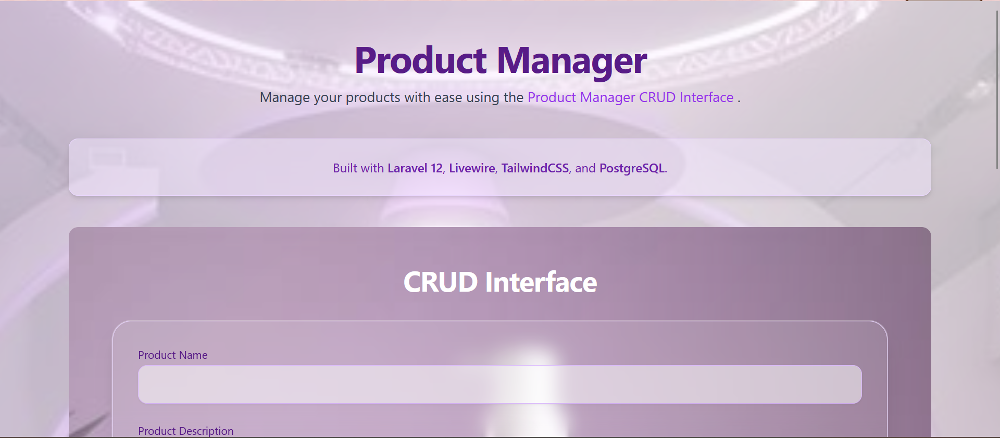
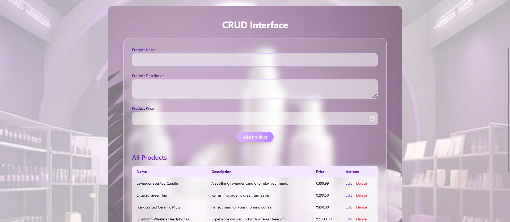
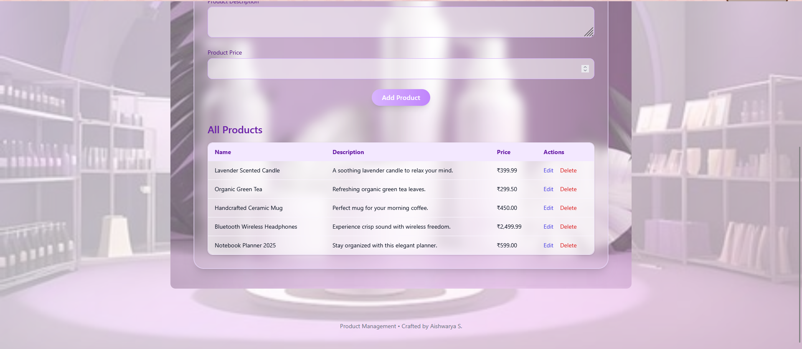
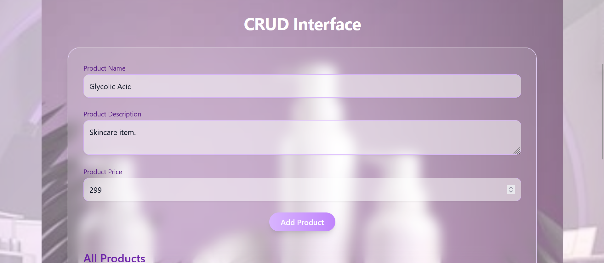
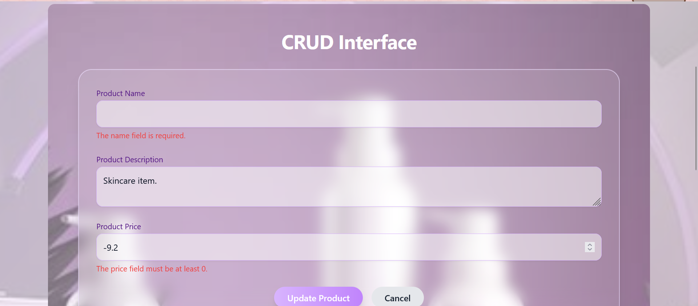

# Product Management System

A stylish Laravel-based CRUD application for managing products with a modern Livewire interface and Tailwind CSS UI.

## Features

- Create, Read, Update, Delete (CRUD) products
- Responsive, glassmorphic UI with Tailwind CSS
- Livewire-powered form reactivity and dynamic updates
- PostgreSQL integration for persistent storage
- Dockerfile setup for deployment on Render

## Preview

  
The landing page of the Product Manager application showcasing an introductory header.

  
A sleek CRUD interface where users can add, edit, or delete product entries.

  
A clean, responsive table showing all products with corresponding edit and delete action buttons.

  
The product form being used to add a new product, with input fields for name, description, and price.

  
The form pre-filled for editing an existing product, highlighting the update and cancel buttons.

## Technologies Used

- PHP 8.2.12  
- Composer 2.8.6  
- Laravel Framework 12.19.3  
- Node.js v22.14.0  
- npm 10.9.2  
- PostgreSQL 17.4  
- Tailwind CSS 3.4.17  
- Laravel Vite Plugin 1.3.0  
- Vite 6.3.5  
- Livewire 3.6.3  

## Installation

### 1. Clone the repository

```bash
git clone https://github.com/AishwaryaSatheCodes/Product-Management.git
cd Product-Management
```

### 2. Install PHP Dependencies
```bash
composer install
```

### 3.Install Node dependencies and build assets
```bash
npm install
npm run build
```
### 4. Configure environment
 ```bash
 cp .env.example .env
```
### 5. Set your database credentials and app key:
```bash
php artisan key:generate
```
### 6. Run migrations and seeders
```bash
php artisan migrate --seed
```
### 7. Start the development server
```bash
php artisan serve
```
Then visit: http://localhost:8000
